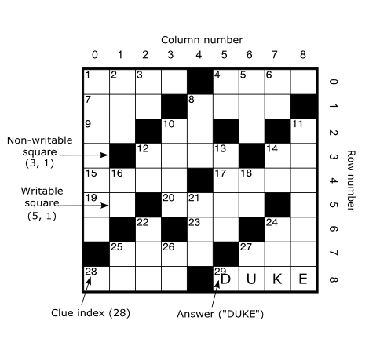

# Crossword

In this exercise you are going to implement Java classes which support defining and solving crosswords.

A crossword consists of a set of *squares*, and has a number of horizontal *rows* and vertical
*columns*. Each square is either *writable* ("white") or not ("black"). A writable square can
contain a single character.

A horizontal or vertical sequence of two or more writable squares contains a *clue* and an
*answer*. One of the tasks of this exercise is to generate clue indices. A square shall contain a clue
index if and only if it is the first square in such a sequence.

The Java interface for a crossword is already defined and should not be modified (see Crossword.java).
Your job is to implement this interface. A skeleton implementation is provided in CrosswordImpl.java.
Methods are listed by increasing complexity, so it is a good idea to start at the top and work your way down,
method by method. The behaviour of each method is clearly defined in the javadoc. You are free to add new
classes. The code you write does not need to be multi-thread safe.

To test your implementation you can run the CrosswordHtmlDemo class. This is a sample application which creates
a simple crossword and generates an HTML representation of it. By default it creates the crossword in the figure
above.

