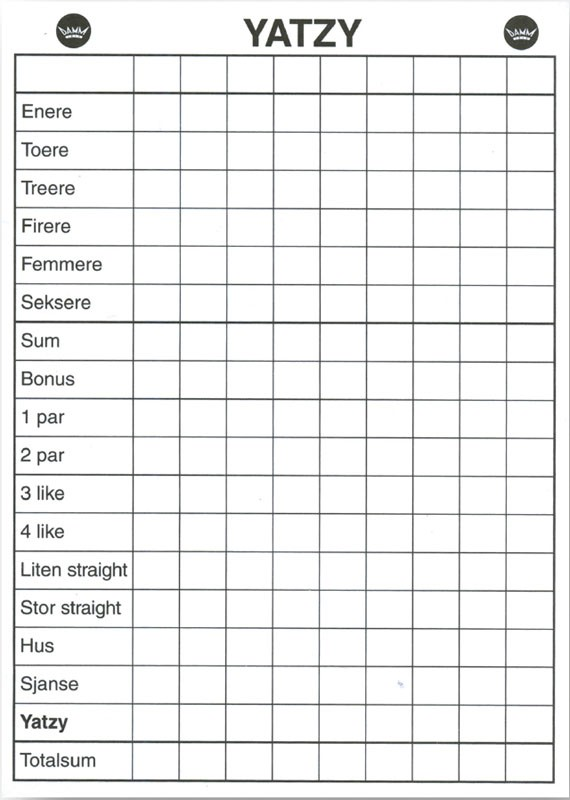

# Yatzy

Du skal lage et java-bibliotek som kan brukes av en klient (typisk GUI) som implementerer yatzy.

Det er ønskelig at biblioteket skal kunne fasilitere spillet:

* Kaste terninger
* Gi informasjon om hvilke kombinasjoner du har fått
* Summere opp og avgjøre om du har fått “bonus”
* Andre ting det er naturlig å legge til et bibliotek.

Hvis du er i tvil om reglene eller hvordan biblioteket skal oppføre seg kan du spørre produkteieren som sitter sammen med deg.

### Om spillet / Regler
Yatzy er et spill med terninger som kan spilles av flere personer. Yatzy spilles med fem terninger som har ”øyne” fra 1 til 6.
Poenget med Yatzy er å ende opp med den høyeste totale poengsummen. Man kan velge å spille tvungen Yatzy, som innebærer at man er nødt til å følge rekkefølgen på poengblokka,
eller såkalt fri Yatzy, hvor man selv velger hvor man ønsker å føre opp resultatet etter sin runde. Hver spiller har tre kast per runde og det er opp til
spilleren å spare på enkelte eller alle terninger for hvert kast, avhengig av hva man forsøker å oppnå. Poengene regnes ut etter antall øyne på terningene.

De aktuelle kombinasjonene man skal prøve å få står oppført på poengblokka:

Over streken står: Enere, toere, treere, firere, femmere og seksere.  Målet er å få så mange terninger med samme antall øyne som mulig i en runde.

Om man klarer å få 63 poeng eller mer når disse er regnet sammen, oppnår man i tillegg en bonus på 50 poeng som legges til på arket. For å oppnå 63 poeng må man ha minimum tre av hver kombinasjon, eller tilsvarende flere av én om man mangler på en annen.

Under linjen står de påfølgende kombinasjonene man skal oppnå.

* Ett par: To like terninger  med så høyt antall øyne som mulig.
* To par: To like terninger x 2  med så høyt antall øyne som mulig.
* Liten straight: er fem terninger med verdien 1 til 5
* Stor straight: er fem terninger med verdien 2 til 6.
* Hus: er to like pluss tre like terninger.
* Sjanse: Ingen krav til kombinasjon av terninger
* Yatzy: Alle terningene skal ha samme antall øyne. Gir 50 poeng